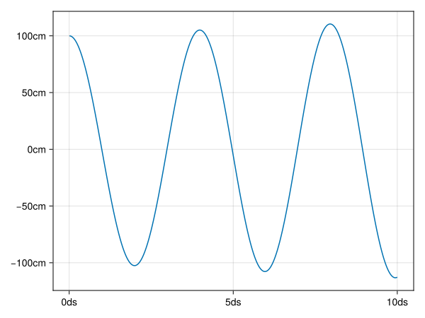

# Example

It cannot be helped that this example will seem a bit contrived.

We're modelling the movement of a spring. It can be useful to put some common definitions in a separate module.

```julia
#| file: examples/spring.jl

using ModuleMixins
using CairoMakie
using Unitful

module Common
abstract type AbstractInput end
abstract type AbstractState end

function initial_state(input::AbstractInput)
    error("Can't construct from AbstractInput")
end

export AbstractInput, AbstractState, initial_state
end

<<example-time>>
<<example-spring>>
<<example-run>>
```

The model has input parameters and a mutable state.
We'll have a time component:

```julia
#| id: example-time

@compose module Time
using Unitful
using ..Common

@kwdef struct Input <: AbstractInput
    t_step::typeof(1.0u"s")
    t_end::typeof(1.0u"s")
end

mutable struct State <: AbstractState
    time::typeof(1.0u"s")
end

function step!(input::AbstractInput, state::AbstractState)
    state.time += input.t_step
end

function run(model, input::AbstractInput)
    s = model.initial_state(input)
    Channel() do ch
        while s.time < input.t_end
            model.step!(input, s)
            put!(ch, deepcopy(s))
        end
    end
end
end
```

Note that the `run` function is generic.
And a component for the spring.

```julia
#| id: example-spring

@compose module Spring
@mixin Time
using ..Common
using Unitful

@kwdef struct Input <: AbstractInput
    spring_constant::typeof(1.0u"s^-2")
    initial_position::typeof(1.0u"m")
end

mutable struct State <: AbstractState
    position::typeof(1.0u"m")
    velocity::typeof(1.0u"m/s")
end

function step!(input::AbstractInput, state::AbstractState)
    delta_v = -input.spring_constant * state.position
    state.position += state.velocity * input.t_step
    state.velocity += delta_v * input.t_step
end
end
```

Now we may compose these using `@mixin`:

```julia
#| id: example-run

@compose module Model
@mixin Time, Spring
using ..Common
using Unitful

function step!(input::Input, state::State)
    Spring.step!(input, state)
    Time.step!(input, state)
end

function initial_state(input::Input)
    return State(0.0u"s", input.initial_position, 0.0u"m/s")
end
end
```

And see the result.

```julia
#| id: example-run

function plot_result()
    input = Model.Input(
        t_step = 0.001u"s",
        t_end = 1.0u"s",
        spring_constant = 250.0u"s^-2",
        initial_position = 1.0u"m",
    )

    output = Time.run(model, input) |> collect
    times = [f.time for f in output]
    pos = [f.position for f in output]

    fig = Figure()
    ax = Axis(fig[1, 1])
    lines!(ax, times, pos)
    save("docs/src/fig/plot.svg", fig)
end

plot_result()
```


