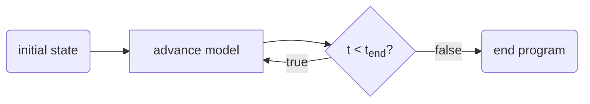
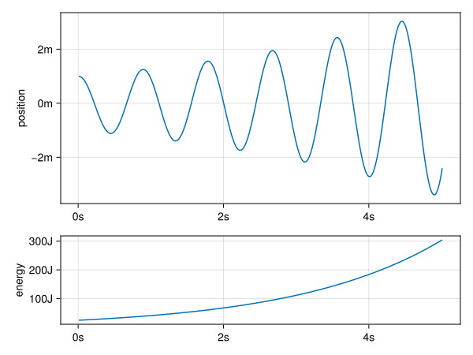
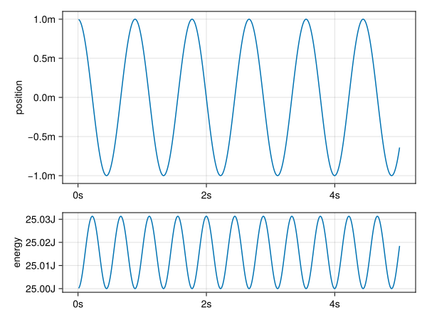
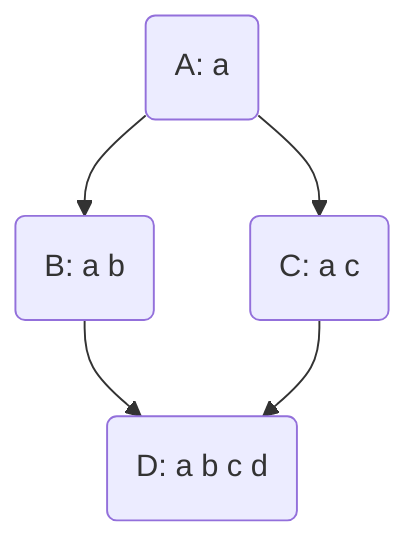
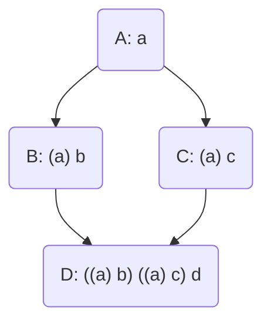

# Objects, Inheritance and Modules in Julia

Julia is an amazing programming language that finds its use mainly in the hands of scientific modelers. Julia combines a welcoming syntax that doesn't scare new users with stellar performance rivaling C++ and Fortran. While Julia is easy to get into – the basics are a hybrid between Python and Matlab – there are some quirks to the language that change the way you need to think about overall program architecture: there are no objects. However, don't be discouraged: there is a reason for everything. I'll explain not only how we can work around the lack of objects, but also to embrace it! Last but not least, I present a new module to plug the final hole in the sea of abstractions that is left by the absence of objects: mixins, but more on that later.

## The JIT compiler

Julia aims to be both user-friendly and fast to execute. To achieve this, we get the wonderful mix of a dynamically typed language that is compiled to machine instructions, just-in-time (JIT). This works as follows: when a function is called we know the types of the arguments (the type signature) that are given as input, and the compiler generates optimized code for that specific type signature. When the function is called again with the same signature, the compiled version is reused from cache.

### Multiple dispatch

Since the type signature is such an integral part of the execution model, there is a nice trick we can play: multiple dispatch. We can redefine the same method for many different type signatures (similar to function overloading in C++). For instance, the addition operator has (as of Julia 1.10) 189 method implementations.

### Multiple dispatch supersedes objects

Multiple dispatch leads us to our first comparison with object oriented languages: abstract method calls are a dispatch on just the first parameter (self or this). In this respect the level of abstraction that multiple dispatch offers is more powerful than the idea of tying method implementations to compound types (i.e. objects). However, object oriented programming is more than just objects. Let's see how Julia compares.

## Object Oriented Programming

Object Oriented Programming as we know it today is a group of abstractions guided around the principle of having some way to dynamically look-up a method implementation for some object. I know this skips over the origin and abstract concepts around objects as they were found in the Smalltalk language, but that is besides the point. OOP as we know it is mostly designed around a mostly  antiquated run-time involving pointers and vtables. What I'm getting at, is that the abstractions in a language are often very much guided by the underlying run-time implementation. That means that in C++ the idea of classes makes sense. In Python we already have a very different view of an object, as everything is based around objects being hashmaps with some commonly understood interface. In Julia, having such a different run-time, multiple dispatch makes sense. Quite similar to the idea that the kind of music we make or hear depends on the setting in which it is staged (opera house without electric amplification, a living room setting, a noisy café or earbuds on a daily commute) and the available technology, more so than other cultural considerations.
Meanwhile, we have entire schools of thought on how to organise code and design architectures around larger code bases. These ideas have been heavily influenced by the tools of the time: Java and C++. So, all that considered, what do we understand by Object Oriented Programming?

- Compartimenting program state: data hiding, modularization
- Message passing between objects: similar to above, an object's behaviour can be completely understood from the way we poke sticks at it.
- Abstraction over interfaces: the interface is the outer shell of an object. If the implementations are widely different but the interface is the same, we can freely interchange objects of different types in cases of heterogeneous data.
- Inheritance or composition: we can use smaller objects to build larger ones. This can be done by inheritance, whereby the larger object behaves the same as the smaller one, except it can do more. The other way is by composition: we wrap the smaller object into the larger one, defining a new interface, but retaining the functionality.

In Julia we can achieve all these goals with multiple dispatch, except inheritance. Keep in mind that Julia is a dynamically typed language. Not only that, it fully embraces being dynamically typed through the dispatch mechanism.

## Functions, Methods, Interfaces

Ok, now we know: Julia doesn't have classes. How do we then organize our code? What are the means of abstraction? A common pattern is to define methods around types with similar utility. Suppose we want to write our own collection type, say a circular buffer that overwrites itself, only remembering the last $n$ items that were added.

```julia
mutable struct CircularBuffer{T}
    content::Vector{T}
    endloc::Int
    length::Int
end

CircularBuffer{T}(size::Int) where T =
    CircularBuffer{T}(Vector{T}(undef, size), 1, 0)
```

If we want `CircularBuffer` to behave like other collections in Julia, we need to define some methods.

```julia
Base.isempty(b::CircularBuffer{T}) where T = b.length == 0

function Base.empty!(b::CircularBuffer{T}) where T
    b.length = 0
    b.endloc = 1
end

Base.length(b::CircularBuffer{T}) where T = b.length
Base.checked_length(b::CircularBuffer{T}) where T = b.length
```

Here we see that we can make methods that are in the standard library operate on our own custom types.

The weakness in this approach is that none of this is checked at compile time.

## Composition over Inheritance

Suppose we're developing something of a graphics library. We have defined a type to work with points:

```julia
struct Point
    x::Float64
    y::Float64
end

Base.:+(a::Point, b::Point) = Point(a.x+b.x, a.y+b.y)
```

Now, we want to add colour to our points. We have a colour type that stores colour as an RGB triple. For convenience, we'll even throw in an abstract type `AbstractColour`

```julia
struct Colour
    r::Float64
    g::Float64
    b::Float64
end
```

We could do the following:

```julia
struct ColouredPoint
    x::Float64
    y::Float64
    colour::Colour
end
```

For the `Point` type we had defined an addition operator. How would you define that for the `ColouredPoint`? How do we handle the colour information?

In this example it is quite obvious that the better other option is to use **composition**.

```julia
struct ColouredPoint
    point::Point
    colour::Colour
end
```

In general, for most cases it is considered best practice to prefer composition over inheritance. Good for us, since Julia does not implement inheritance.

## Critique against OOP


## Composing Modules

Now I present another example which requires a different form of inheritance, and is not so easily expressed using object composition (of the kind shown above). Moreover, we'll see that we can combine the idea of an **interface** in Julia with that of a **module**, creating something that works much the same as a class in other languages.

We need to get an overview of the problem: we'll implement a simple physics model, first without any abstraction. Then we'll use modules and mixins to restructure that code. Along the way you'll learn an interesting fact about physical modelling. We will model a bouncing weight on a spring. The spring exerts a force proportional to the position of the weight.


Such a system is described by having a force proportional and opposite to the relative position of the weight. To model this system, we need to keep track of both the velocity and the position of the object.

Our model has an `Input` structure to store all the parameters, and a `State` structure that is updated on every iteration.



First of all, the input structure: we need to specify the properties of the spring (spring constant, and weight of the moving object), the specifics of our time integration (in this case, the time step and final time), and the initial conditions. In a larger model there will be many more parameters.

```julia
#| id: just-a-spring
using Unitful

@kwdef struct Input
    initial_position::typeof(1.0u"m")
    spring_constant::typeof(1.0u"N/m")
    mass::typeof(1.0u"kg")
    time_step::typeof(1.0u"s")
    time_end::typeof(1.0u"s")
end
```

A typical model will have some mutable `State`.

```julia
#| id: just-a-spring
@kwdef mutable struct State
    time::typeof(1.0u"s")
    position::typeof(1.0u"m")
    velocity::typeof(1.0u"m/s")
end
```

The first state is created from the given input. Here, we only configure the initial position of the spring and hard-coded the initial velocity to zero.

```julia
#| id: just-a-spring
init(input::Input) =
    State(time = 0.0u"s", position = input.initial_position, velocity = 0.0u"m/s")
```

Then we `step!` over this state, until some condition is met.

```julia
#| id: just-a-spring
function step!(input::Input, state::State)
    Δt = input.time_step
    Δx = state.velocity * Δt
    Δv = -state.position * input.spring_constant / input.mass * Δt

    state.time += Δt
    state.position += Δx
    state.velocity += Δv
end
```

We'll go ahead and write the main loop in a generic way.

### Modules as classes

In Julia, modules can be passed around much the same as integers or functions [^1]. Given that we expect a module to have an `init` and `step!` function as well as a `State` type, we can write a generic function for running our model.

[^1]: That is, passed around as arguments to functions. However, modules cannot be created dynamically.

We put the previous code inside a module called `Spring` and then write a `run` function that turns a module and input record into a sequence of output values.

```julia
#| id: spring-run-slow
function run(model::Module, input)
    state = model.init(input)
    Channel{model.State}() do ch
        while state.time < input.time_end
            model.step!(input, state)
            put!(ch, deepcopy(state))
        end
    end
end
```

There is a problem with this code: it is very slow. The `model.init` and `model.step!` items are resolved through dynamic look-up. We can make it a lot faster by forcing the compiler to specialize for every model we give it.

```julia
#| id: spring-run-fast
struct Model{T} end

function run(::Type{Model{M}}, input) where M
    state = M.init(input)
    Channel{M.State}() do ch
        while state.time < input.time_end
            M.step!(input, state)
            put!(ch, deepcopy(state))
        end
    end
end
```

Let's see what this does, by visualizing the output. Here, we also show the energy of the system.

```julia
#| id: just-a-spring
function energy(input::Input, state::State)
    k = state.velocity^2 * input.mass / 2
    v = state.position^2 * input.spring_constant / 2
    return k + v
end
```

!!! details "Plotting code"

    ```julia
    #| id: spring-plot
    function plot_result(input, output, energy)
        times = [f.time for f in output]
        pos = [f.position for f in output]

        fig = Figure()
        ax1 = Axis(fig[1:2, 1];
            ylabel = "position",
            dim1_conversion = Makie.UnitfulConversion(u"s"),
            dim2_conversion = Makie.UnitfulConversion(u"m"),
        )
        lines!(ax1, times, pos)
        ax2 = Axis(fig[3, 1];
            ylabel = "energy",
            dim1_conversion = Makie.UnitfulConversion(u"s"),
            dim2_conversion = Makie.UnitfulConversion(u"J"),
        )
        lines!(ax2, times, energy)
        fig
    end
    ```

    ```julia
    #| file: examples/just_a_spring.jl
    #| classes: ["task"]
    #| creates:
    #|   - docs/src/fig/just-a-spring.svg
    #| collect: figures
    module Spring
        <<just-a-spring>>
    end

    module Script
        using Unitful
        using CairoMakie
        using ..Spring

        <<spring-run-fast>>
        <<spring-plot>>

        function main()
            input = Spring.Input(
                time_step = 0.01u"s",
                time_end = 5.0u"s",
                spring_constant = 50.0u"N/m",
                initial_position = 1.0u"m",
                mass = 1.0u"kg",
            )

            output = run(Model{Spring}, input) |> collect
            energy = [Spring.energy(input, s) for s in output]
            fig = plot_result(input, output, energy)
            save("docs/src/fig/just-a-spring.svg", fig)
        end
    end

    Script.main()
    ```

!!! info "Simulation of a spring"

    

    Our simulation is running, but there appears to be something wrong here! Why is the amplitude of the oscillation increasing? Remember, we set the initial velocity to 0. After one step of forward Euler integration we have a velocity $|v| > 0$, but the position is still the same, so the system gets a boost. The integration method is not energy conserving.

Now that we're familiar with the problem, let's try to deconstruct this program into multiple components.

### With Mixins

Now, we implement the same model using `ModuleMixins.jl`.

We define some common types:

```julia
#| id: mixin-a-spring
module Common
    export AbstractInput, AbstractState, Model, run

    abstract type AbstractInput end
    abstract type AbstractState end

    <<spring-run-fast>>
end
```

We split our concerns into a `Time` module and a `Spring` module. Both these modules define an `Input` and `State` struct as well as the `init` and `step!` functions.

```julia
#| id: mixin-a-spring
@compose module Time
    using Unitful
    using ..Common

    @kwdef struct Input <: AbstractInput
        time_step::typeof(1.0u"s")
        time_end::typeof(1.0u"s")
    end

    @kwdef mutable struct State <: AbstractState
        time::typeof(1.0u"s")
    end

    function init(input::AbstractInput)
        State(time = 0.0u"s")
    end

    function step!(input::AbstractInput, state::AbstractState; fraction::Float64 = 1.0)
        state.time += fraction * input.time_step
    end
end
```

Although the `Time` model doesn't compute anything interesting, we could call `Model.run(Time, Time.Input(0.1u"s", 1.0u"s"))`, and collect a series of time coordinates. There is something satisfying about being able to build out complexity from humble beginnings.
In the `Spring` module, we extend the `Input` and `State` definitions present in `Time` and recreate the oscillator model we had before.

```julia
#| id: mixin-a-spring
@compose module Spring
    @mixin Time
    using Unitful
    using ..Common

    @kwdef struct Input <: AbstractInput
        initial_position::typeof(1.0u"m")
        spring_constant::typeof(1.0u"N/m")
        mass::typeof(1.0u"kg")
    end

    @kwdef mutable struct State <: AbstractState
        position::typeof(1.0u"m")
        velocity::typeof(1.0u"m/s")
    end

    accelleration(input::AbstractInput, state::AbstractState) =
        -state.position * input.spring_constant / input.mass

    energy(input::AbstractInput, state::AbstractState) =
        let k = state.velocity^2 * input.mass / 2,
            v = state.position^2 * input.spring_constant / 2
            k + v
        end

    step!(input::AbstractInput, state::AbstractState) =
        let a = accelleration(input, state)
            state.position += state.velocity * input.time_step
            state.velocity += a * input.time_step
            Time.step!(input, state)
        end

    init(input::AbstractInput) =
        State(time = 0.0u"s", position = input.initial_position, velocity = 0.0u"m/s")
end
```

### Using a better integrator

In the first part we saw that there were some shortcomings to the `step!` method, in that energy was not conserved. The integration method we used is also known as the **forward Euler** method. There is a better way integrate systems for which energy is conserved, known as the **leap-frog** method. The idea is to compute the change in velocity and the change in position at times offset by half a time step. These partial step methods are known as `kick!` (changing the velocity) and `drift!` (changing the position).

```julia
#| id: mixin-a-spring
module LeapFrog
    using ..Common
    using ..Time

    function leap_frog(::Type{Model{M}}) where M
        function (input::AbstractInput, state::AbstractState)
            M.kick!(input, state)
            Time.step!(input, state; fraction = 0.5)
            M.drift!(input, state)
            Time.step!(input, state; fraction = 0.5)
        end
    end
end
```

Now, let's see if we can extend our previous implementation of `Spring` to work with the new integrator. Notice that we can import methods from `Spring` for reuse.

```julia
#| id: mixin-a-spring
@compose module LeapFrogSpring
    @mixin Spring
    using ..Common
    using ..Spring: energy, init, accelleration
    using ..LeapFrog

    Base.convert(::Type{State}, s::Spring.State) =
        State(time=s.time, position=s.position, velocity=s.velocity)

    kick!(input::AbstractInput, state::AbstractState) =
        state.velocity += accelleration(input, state) * input.time_step

    drift!(input::AbstractInput, state::AbstractState; fraction::Float64=1.0) =
        state.position += state.velocity * input.time_step * fraction

    const step! = LeapFrog.leap_frog(Model{LeapFrogSpring})
end
```

!!! note "Why the `convert` function?"

    Note that the `Spring.init` function will return a value `Spring.State`. However, the `Model.run` function expects a `LeapFrogSpring.State` instead. I may patch `ModuleMixins` to create a type alias and not define a new identical type when nothing changes. For the moment, a `convert` function fixes the situation.

!!! note "What did we use here?"

    Also note that we didn't do anything strange here. The only thing we used from `ModuleMixins` is the composition and inheritance of `struct` definitions. The rest is just using standard Julia modules creatively. Not only did we see inheritance in action, the `LeapFrog` module could be seen as a transformer, taking one interface (having `kick!` and `drift!`), and turning it into another one (generating a `step!`).

!!! info "Result from the Leap-frog integrator"

    

!!! details "Plotting code"

    ```julia
    #| file: examples/mixin_a_spring.jl
    #| classes: ["task"]
    #| creates:
    #|   - docs/src/fig/mixin-a-spring.svg
    #| collect: figures
    using ModuleMixins: @compose

    <<mixin-a-spring>>

    module Script
        using Unitful
        using CairoMakie
        using ModuleMixins

        using ..Time
        using ..Spring
        using ..Common
        using ..LeapFrogSpring

        <<spring-plot>>

        function main()
            input = LeapFrogSpring.Input(
                time_step = 0.01u"s",
                time_end = 5.0u"s",
                spring_constant = 50.0u"N/m",
                initial_position = 1.0u"m",
                mass = 1.0u"kg",
            )

            output = Common.run(Model{LeapFrogSpring}, input) |> collect
            energy = map(output) do s
                # correction for overshooting
                LeapFrogSpring.drift!(input, s; fraction=-0.5)
                LeapFrogSpring.energy(input, s)
            end
            fig = plot_result(input, output, energy)
            save("docs/src/fig/mixin-a-spring.svg", fig)
        end
    end

    Script.main()
    ```

    ```julia
    #| id: mixin-a-spring
    ```

So far, what we did could have been achieved with different techniques, like dispatch and trait types. The real reason why we use `ModuleMixins` is to handle the composition of data (i.e. `struct` types and their fields). What we've seen here, is that the way `ModuleMixins` solves that problem blends nicely with an almost object-oriented style of programming.

We've seen how we can use `ModuleMixins` to compose models from smaller components. The `Time` component could be reused for a different model, and we could use what we had (a forward Euler method) and extend it (to Leap-frog method), giving us both **reusability** and **extensibility**.

Where `ModuleMixins` is absolutely needed, is when our problem grows in complexity, such that data composition is no longer trivially solved by ordinary object composition. The minimal example of such a problem occurs when we have a diamond shaped dependency tree.

## Diamond dependencies

There is a case where using a construct similar to `ModuleMixins` becomes inevitable: the diamond dependency pattern.

```@example 1
using ModuleMixins: @compose

@compose module A
    struct S a::Int end
end

@compose module B
    @mixin A
    struct S b::Int end
end

@compose module C
    @mixin A
    struct S c::Int end
end

@compose module D
    @mixin B, C
    struct S d::Int end
end

fieldnames(D.S)
```

We may draw a dependency diagram for this example:



### What is special about the diamond?

If we had used composition to create these dependencies, we would have arrived at a different conclusion:



We end up with **two** copies of `A`. We could implement this so that `D.b.a` and `D.c.a` point to the same object, but doing so increases the amount of indirection and complexity in our code needlessly.

## Performance

```julia
#| file: examples/spring-benchmark.jl
using BenchmarkTools
using ModuleMixins: @compose

<<mixin-a-spring>>

module Compute
    using ..Common: Model
    using ..LeapFrogSpring: Input, State
    using Unitful

    function plain(input::Input)
        state = State(time = 0.0u"s", position = input.initial_position, velocity = 0.0u"m/s")
        n_steps = input.time_end / input.time_step |> Int

        for i = 1:n_steps
            a = -state.position * input.spring_constant / input.mass
            state.velocity += a * input.time_step
            state.time += 0.5*input.time_step
            state.position += state.velocity * input.time_step
            state.time += 0.5*input.time_step
        end

        return state
    end

    function fancy(::Type{Model{M}}, input::Input) where M
        state = M.init(input)
        n_steps = input.time_end / input.time_step |> Int

        for i = 1:n_steps
            M.step!(input, state)
        end

        return state
    end
end

module Benchmark
    using ..LeapFrogSpring
    using Unitful
    using ..Common: Model
    using ..Compute
    using BenchmarkTools

    const input = LeapFrogSpring.Input(
        time_step = 0.01u"s",
        time_end = 5.0u"s",
        spring_constant = 50.0u"N/m",
        initial_position = 1.0u"m",
        mass = 1.0u"kg",
    )

    function main()
        a = @benchmark Compute.plain(Benchmark.input)
        display(a)
        b = @benchmark Compute.fancy(Model{LeapFrogSpring}, Benchmark.input)
        display(b)
    end
end

Benchmark.main()
```

## Resources

- [Matthijs Cox's blog post on fruity design patterns](https://scientificcoder.com/fruity-composable-design-patterns-in-julia)
- [Emergent Features of JuliaLang, part II: traits](https://www.juliabloggers.com/the-emergent-features-of-julialang-part-ii-traits/)
